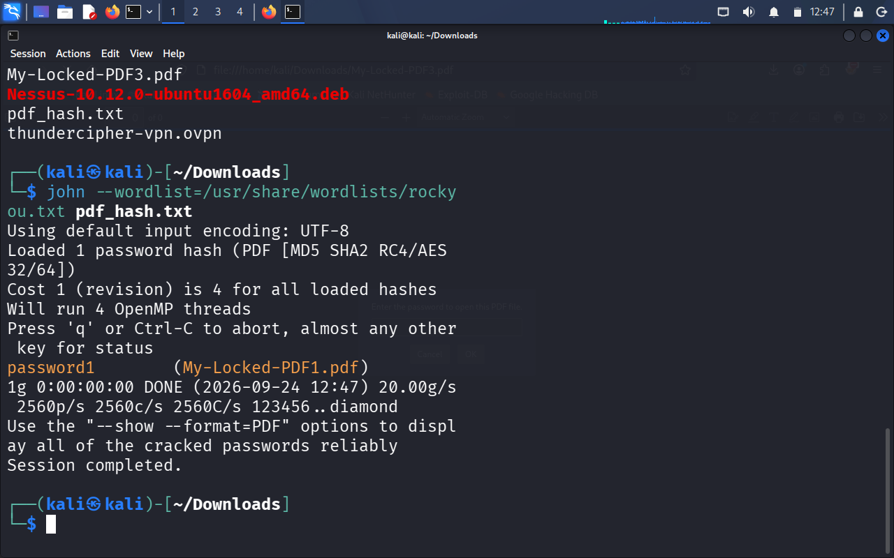
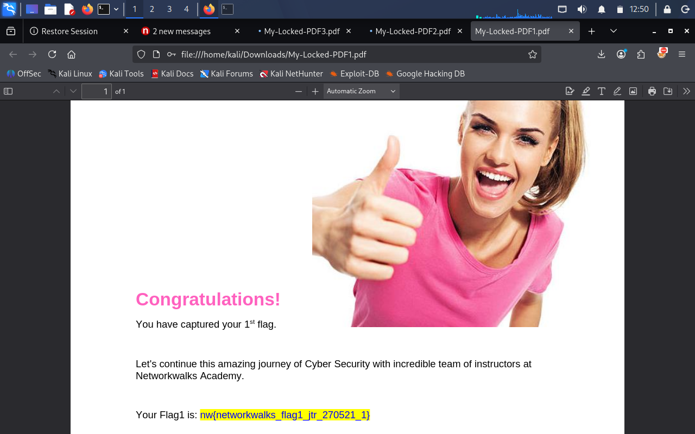
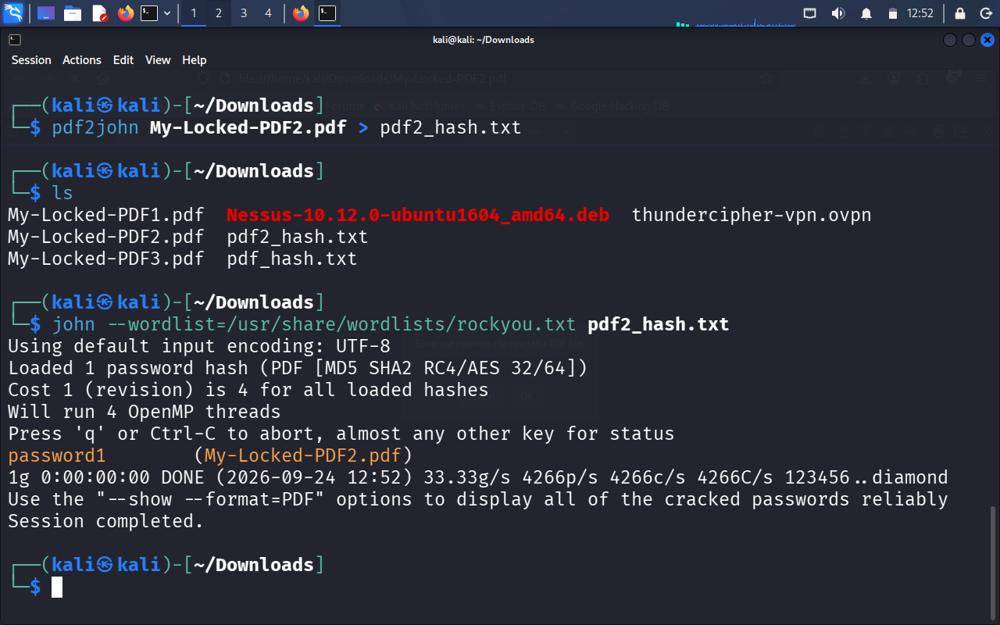
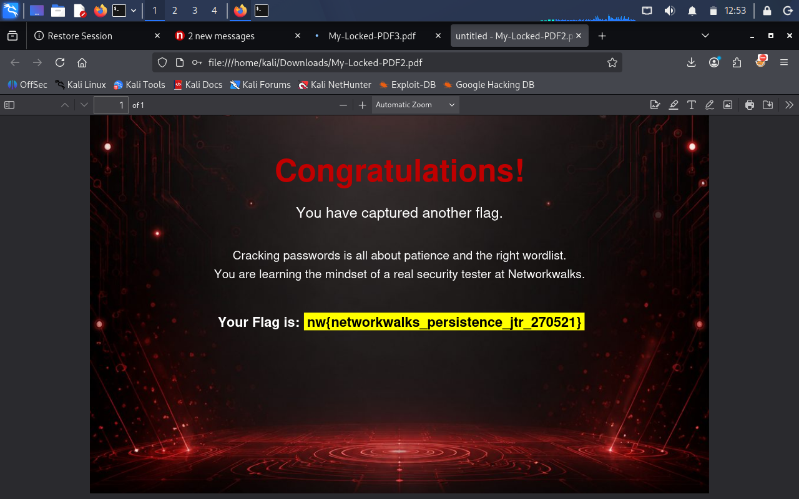
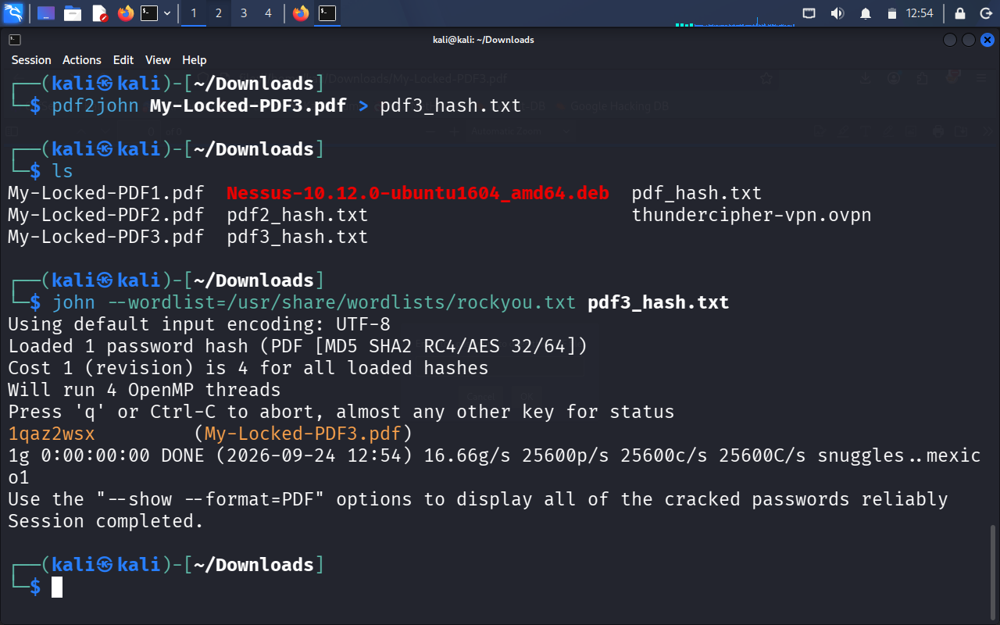
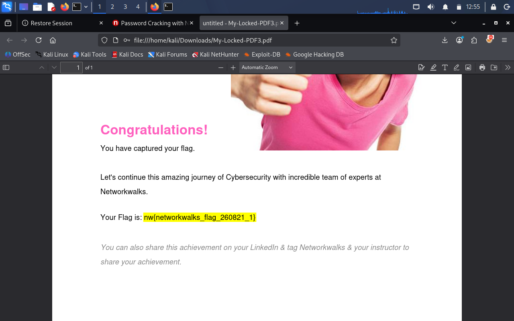
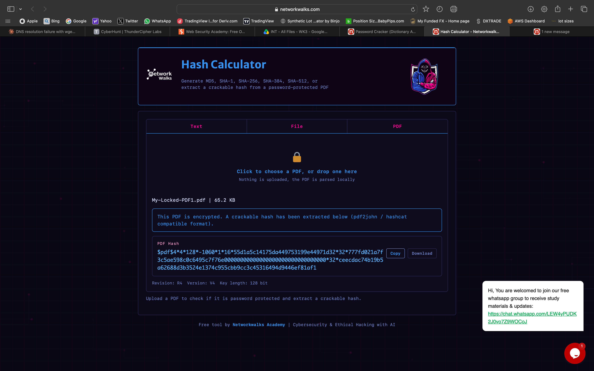
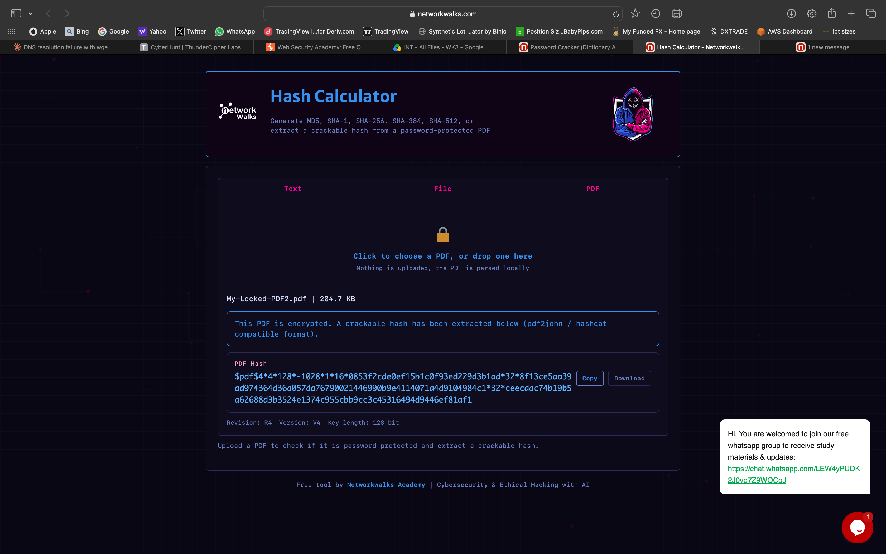

# NETWORKWALKS-B083-WK3-CYBERSECURITY-LAB-PASSWORD-CRACKING-JTR

 **# 🔐 Cybersecurity Lab Report: Password Cracking with JTR & Networkwalks Tools**

 ---

## 1. Purpose of Lab
This lab provides practical, hands-on experience in password recovery and hash-cracking methods as applied to password-protected PDF documents, examining two distinct approaches to the process:

Module 1 – Offline Hash Cracking: Extract the document's hash using available online or offline tools, then run local dictionary and brute-force attacks against it using John the Ripper (JTR).
  
Module 2 – Web-Based Hash & Password Cracking: Use specialized Networkwalks tools (Hash Calculator and Password Cracker) to extract hash signatures and recover cleartext passwords via their web interfaces.

---

## 2. Step-by-Step Process of Both Modules

### Module 1: Password Cracking with JTR

#### **Step 1: Environment & Tool Setup**
1. Ensured **John the Ripper (JTR)** was at its newest version on Kali Linux CLI.

#### **Step 2: PDF File Acquisition & Hash Extraction**
1. Downloaded the target locked files: `My Locked PDF1.pdf`, `My Locked PDF2.pdf`, and `My Locked PDF3.pdf`.
2. Converted pdf files to hash.txt in Kali Linux CLI, using the pdf2john command.

#### **Step 3: Executing Hash Attack**
Using the John command, the hash.txt file was run against the rocky.txt wordlist

#### **Step 4: Verification & Unlocking**
1. Copied the recovered plaintext password.
2. Opened `My Locked PDF1.pdf` using Adobe Acrobat / Web Browser.
3. Entered the recovered password to successfully unlock and view the PDF contents.
4. Repeated Steps 3–4 for `My Locked PDF2.pdf` and `My Locked PDF3.pdf`.

---

### Module 2: Password Cracking with Networkwalks Tools

#### **Step 1: Hash Calculation**
1. Navigated to the Networkwalks Hash Calculator web application (networkwalks.com/hash-calculator/).
2. Uploaded the target file My Locked PDF1.pdf.
3. The tool processed the file's header data and generated the corresponding document hash string.
4. Copied the resulting hash string to the clipboard.

#### **Step 2: Web-Based Password Recovery**
1. Opened the Networkwalks Password Cracker tool interface.
2. Pasted the previously generated PDF hash into the input field.
3. Initiated the crack/decryption process.
4. Recorded the recovered cleartext password displayed on screen.

#### **Step 3: Verification**
1. Opened `My Locked PDF1.pdf` on the MacBook PC.
2. Inputted the cracked password provided by Networkwalks Password Cracker.
3. Confirmed full access to the target document.

---

## 3. Tools and Links

| Tool / Resource | Purpose / Functionality | Link / Reference |
| :--- | :--- | :--- |
| **John the Ripper (JTR)** | Core open-source offline password security auditing and hash cracking tool. | KALI LINUX CLI|
| **Online Hash Crack** | Online utility to extract password hashes from PDF documents. | [Online PDF Hash Extractor](https://www.onlinehashcrack.com/tools-pdf-hash-extractor.php) |
| **Networkwalks Hash Calculator** | Web tool for calculating and extracting file hashes. | [Networkwalks Hash Calculator](https://networkwalks.com/hash-calculator/) |
| **Networkwalks Password Cracker** | Dedicated web application for cracking extracted security hashes. | Networkwalks Academy Portal |

---

## 4. What I Learned

**Hash Extraction vs. Password Cracking**: PDF encryption doesn't store passwords in plain text — it relies on hash-based verification instead. Modern cracking approaches first isolate the document's hash header, allowing it to be processed offline without altering or locking the original file.

**Offline Attack Speed & Flexibility**: Local command-line and GUI tools like JTR and Johnny give full control over attack modes (wordlists, rules, mask attacks) while taking advantage of CPU/GPU processing power.

**GUI Wrappers for Security Tools**: Front-ends like Johnny make session management, hash importing, and progress tracking easier, without sacrificing the underlying power of JTR's cracking engine.

**Impact of Password Complexity**: Weak passwords protected by standard PDF encryption can often be cracked quickly through dictionary or rule-based attacks.

**Mitigation Strategies**: Preventing successful cracking attempts requires enforcing long, complex passphrase policies and using strong encryption schemes — such as AES-256 with robust key derivation functions.

## 5. Evidence Collected.

